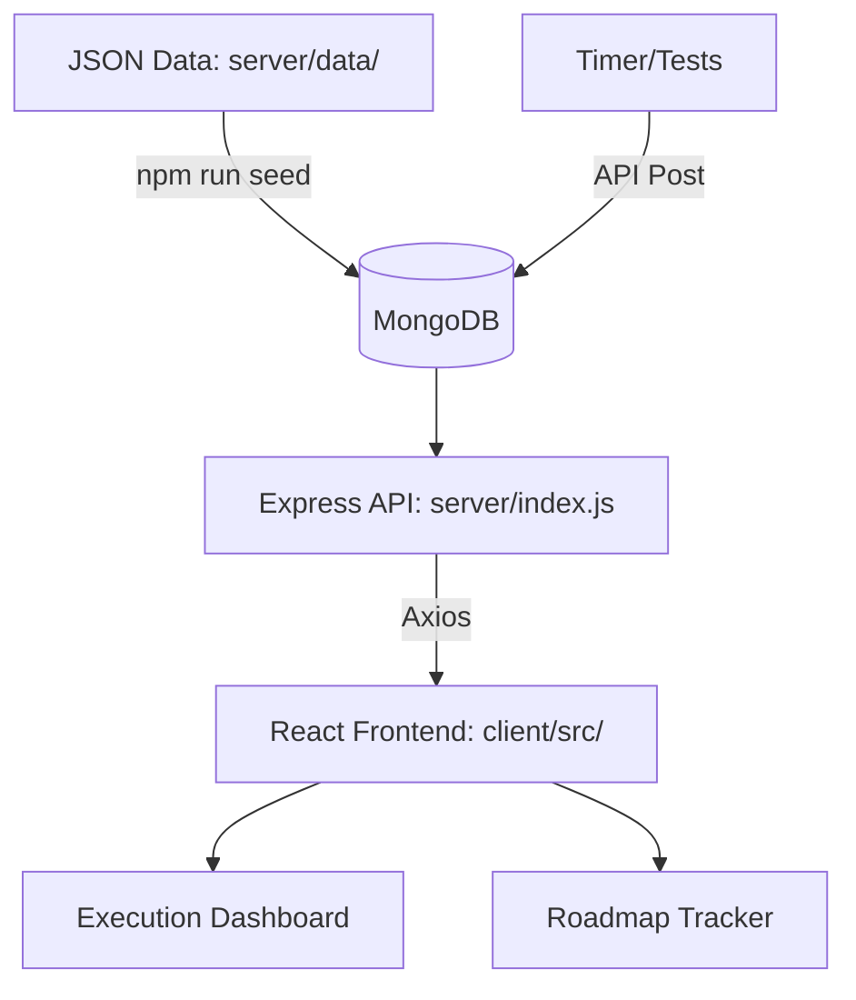

# 🚀 PPTracker - Placement Prep Tracker

PPTracker is a modern, full-stack MERN application designed for focused placement preparation. It provides a structured environment for tracking progress in **DSA**, **DevOps**, and **System Design**, complete with visual analytics, a deep-work study timer, and self-assessment modules.

---

## 🌟 Key Features

*   **Preloaded Roadmaps**: Comprehensive, tree-structured roadmaps for DSA, DevOps, and SD.
*   **Execution Dashboard**: Real-time progress visualization with Recharts (Pie/Bar charts) and a customizable goal countdown.
*   **Study Focus Timer**: A precise HH:MM:SS Pomodoro-style timer with looping alarm notifications.
*   **Self-Assessment**: Log your practice test results and track weak areas over time.
*   **Glassmorphism UI**: A premium, dark-mode design built with React and Tailwind CSS v4.

---

## 📂 Project Structure & Execution Paths

To ensure the app runs correctly, follow the execution paths below:

| Action | Path (Terminal) | Command |
| :--- | :--- | :--- |
| **Install Everything** | `Root/` | `npm run install-all` |
| **Seed/Update Data** | `Root/` | `npm run seed` |
| **Run Development** | `Root/` | `npm run dev` |
| **Manual Backend** | `Root/server/` | `npm run dev` |
| **Manual Frontend** | `Root/client/` | `npm run dev` |

---

## 🔄 Application Flow



1.  **Data Layer**: Roadmaps are defined in `server/data/*.json`.
2.  **Seeding**: The `seeder.js` script parses these JSONs and populates MongoDB.
3.  **API Layer**: Express routes provide endpoints for roadmaps, analytics, and study logs.
4.  **UI Layer**: React components fetch data via Zustand stores and render the interactive interface.

---

## 📥 Local Setup Guide

Follow these steps to run the project on your machine:

### 1. Prerequisites
*   [Node.js](https://nodejs.org/) (v18+)
*   [MongoDB](https://www.mongodb.com/try/download/community) (Running locally on port 27017)
*   [Git](https://git-scm.com/)

### 2. Clone the Repository
```bash
git clone https://github.com/GENIUS-69/PlacementTracker.git
cd PPTracker
```
*Note: Cloning creates a local copy on your machine. Any changes you make locally will **not** affect the original project unless you have permission to push back to this repository.*

### 3. Install Dependencies
Run the unified install command from the root folder:
```bash
npm run install-all
```

### 4. Seed the Database
To load the pre-defined roadmaps into your MongoDB:
```bash
npm run seed
```

### 5. Run the Application
Start both the backend and frontend with a single command:
```bash
npm run dev
```
*   **Frontend**: `http://localhost:5173`
*   **Backend**: `http://localhost:5000`

---

## ⚡ Quick Start (Windows Only)

For a seamless, one-click experience on Windows, you can use the automated launcher:

1.  **Locate**: `Launch_PPTracker.bat` in the root directory.
2.  **Run**: Double-click the file.
3.  **Process**:
    *   Starts the **MongoDB service** (if not already running).
    *   Launches both **Frontend and Backend** in a single minimized background window.
    *   Automatically **opens your browser** to the dashboard once servers are ready.
4.  **Shutdown**: To stop the application, close the minimized terminal window labeled `PPTracker_Servers` in your taskbar.

---

## 🗺️ Customizing Roadmaps

If you want to edit or add your own topics to the roadmaps:

1.  Navigate to `server/data/`.
2.  Open the relevant JSON file: `dsa.json`, `devops.json`, or `system_design.json`.
3.  **Structure**:
    *   `topics`: An array of main categories.
    *   `subtopics`: An array of specific items.
    *   `children`: (Optional) A list of specific concepts inside a subtopic.
4.  **Save & Sync**: After editing the JSON, you **must** re-seed your database for changes to appear in the app:
    ```bash
    npm run seed
    ```

---

## 🐳 Docker Deployment

If you prefer using Docker:
```bash
docker-compose up --build
```
This will start the frontend, backend, and a MongoDB container automatically.

---

## 📄 License
This project is for personal educational use.

---

*Built with ❤️ for Placement Prep.*
